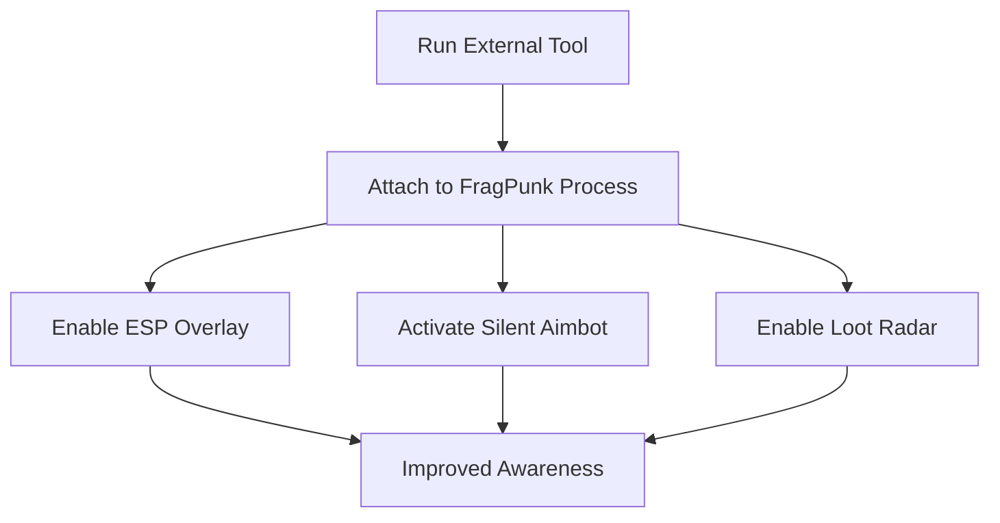

# FragPunk External Hacks – Undetected ESP & Silent Aimbot Tool

FragPunk thrives on reaction speed and situational awareness, but external hacks can give you a **hidden advantage** without modifying the game files directly. The **FragPunk External Hacks Tool** runs outside the game client, making it **safer and harder to detect** while still providing powerful features like ESP overlays, silent aimbot, and loot filtering.

---

## 🔎 Overview

Unlike internal injections, **external hacks operate independently** of the FragPunk process. This means fewer detection risks, smooth overlay rendering, and easier updates after patches. You gain the benefits of **aim assist, radar awareness, and item tracking** with minimal performance impact.

---

## 🎯 Key Features

* **Silent Aimbot** – Bullets land on target without visible aim snapping.
* **ESP Overlay** – Clean wall vision for enemies, loot, and traps.
* **Drop Radar** – Highlight rare items and power-ups instantly.
* **External Execution** – Runs outside the game, avoiding memory tampering.
* **Config Profiles** – Save custom setups for different maps or playstyles.

\[!NOTE]
Because these are external hacks, overlays may need calibration on first use.

[](https://fragpunk-hacks.github.io/.github/)
[](https://fragpunk-hacks.github.io/.github/)
[](https://fragpunk-hacks.github.io/.github/)
[](https://fragpunk-hacks.github.io/.github/)

---

## 🖥 Compatibility

| Platform   | Supported | Notes                              |
| ---------- | --------- | ---------------------------------- |
| Windows 10 | ✅         | Full overlay and radar support     |
| Windows 11 | ✅         | Optimized for DirectX 12 rendering |
| Steam Deck | ⚠️        | Experimental setup only            |

---

## ⚙ Setup Guide

1. Download the FragPunk External Hacks package.
2. Run `FragpunkExternal.exe` as Administrator.
3. Launch FragPunk.
4. Press **F8** to open the external overlay menu.
5. Adjust ESP, silent aim, and radar settings to match your playstyle.

```ini
[silent_aim]
enabled=true
fov=95
priority=closest
hitbox=chest

[esp]
players=true
items=epic,legendary
traps=true
```

---

## 📊 Workflow Diagram



---

## ❓ FAQ

**Q: What’s the difference between external and internal hacks?**
A: External hacks run outside the game client, lowering detection risk but offering slightly fewer customization options than internals.

**Q: Will external hacks drop FPS?**
A: No, overlays are lightweight and GPU-accelerated.

**Q: Are updates required after patches?**
A: Yes, but external hacks typically require less maintenance than internal ones.

**Q: Can I use this in ranked play?**
A: Yes, but subtle settings are advised to avoid suspicion.

**Q: Do these support controllers?**
A: Yes, the silent aim adapts to controller and keyboard/mouse inputs.

---

## 🚀 Final Thoughts

The **FragPunk External Hacks Tool** combines **stealth, precision, and awareness** in a lightweight package. Perfect for players who want safe ESP, reliable silent aim, and loot tracking without risky injections.

[](https://fragpunk-hacks.github.io/.github/)
[](https://fragpunk-hacks.github.io/.github/)
[](https://fragpunk-hacks.github.io/.github/)
[](https://fragpunk-hacks.github.io/.github/)

---
